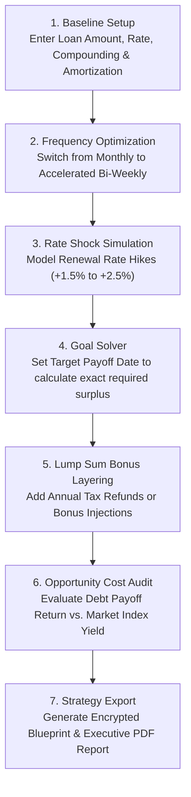

# 🌌 Debt Elimination Engine (v3.1.0)

> **Algorithmic Mortgage, Credit Card & Loan Payoff Optimization Platform**  
> Engineered to eliminate interest friction, defeat compounding drag, and accelerate your path to zero debt.

👉 **[Live Application](https://richardmalo.github.io/TrueMortgageV3/)** | **[GitHub Repository](https://github.com/RichardMalo/TrueMortgageV3)**

---

Welcome to the **Debt Elimination Engine**, an algorithmic, 100% client-side financial strategy platform. It compiles mortgage, credit card, and consumer debt amortization schedules under aggressive pay-down regimes (accelerated payment frequencies, discretionary surplus, renewal rate shocks, scheduled future lump sums) and evaluates them against market investment yield returns (opportunity costs).

The entire application executes **locally in your browser**—all financial calculations, custom profiles, encrypted state payloads, and strategy blueprints remain 100% private and never touch a remote backend server.

---

## 🚀 Key Features & Architectural Highlights

### 1. Triple Optimization Engines

- **Mortgage Engine:**
  - **Regional Compounding Standards:** Canadian fixed mortgages (**semi-annual compounding by law**: $r = 2 \times ((1 + i/2)^{2/f} - 1)$) vs. US/UK/AU/NZ (**monthly nominal compounding**: $r = i / f$).
  - **Canadian Statutory Regulations:** Automatically models tiered minimum down payments (5% up to \$500k, 10% to \$1.5M, 20% floor for \$1.5M+), CMHC mortgage default insurance sliding tiers (up to 95% LTV), the Canadian 30-year amortization surcharge (+0.20%), provincial closing sales taxes (ON 8%, QC 9.975%, SK 6%), and OSFI B-20 qualifying stress test rates.
  - **Land Transfer Tax (LTT) Matrix:** Multi-bracket provincial taxes (ON, QC, BC, AB) and Toronto Municipal MLTT double-bracket system with statutory first-time homebuyer rebate caps (\$4,000 provincial, \$4,475 municipal).
  - **Private Mortgage Insurance (PMI):** Automatic LTV threshold tracking (cancellation at $\le 80\%$ LTV) for US mortgages, with automatic PMI omission for Canadian insured loans.
  - **Accelerated Payment Frequencies:** Monthly, semi-monthly, bi-weekly, accelerated bi-weekly (saving thousands in interest by providing 13 full monthly payments per year), and accelerated weekly schedules.
- **Credit Card Engine:**
  - **Legislation-Compliant Minimum Payments:** Ontario standard (3%) vs. Quebec legal mandate (5%), plus custom percentage/interest+principal rules and flat minimum floors.
  - **Negative Amortization Safeguards:** Handles minimum payments lower than monthly interest without cumulative principal underflow or runaway loops.
- **Personal & Auto Loan Engine:**
  - **Customizable Amortization & Origination Fees:** Models fixed-term consumer loans (personal, auto, student) featuring an optional upfront origination fee toggle and effective APR calculations.
  - **Accelerated Paydown Trajectories:** Models discretionary periodic extra principal paydowns, lump sums, and flexible payment frequencies.

### 2. Advanced Strategy Modeling & Analytics

- **Payoff Goal Solver:** High-precision binary search algorithm ($O(\log N)$) that solves for the exact monthly surplus or one-time lump sum required to achieve a target debt-free date, equipped with feasibility guards.
- **Refinancing Rate Shocks:** Dynamic interest rate adjustments at renewal milestones (e.g. modeling 5-year fixed or variable term rate hikes/drops) with integer period boundary math.
- **Scheduled Future Lump Sums:** Dynamic scheduled lump-sum payments (annual bonuses, tax refunds) at specific payment numbers with automated date badges.
- **Opportunity Cost Analytics:** Directly compares paying off low-interest debt early versus investing surplus cash flow in market index funds. Features an $O(N)$ linear cursor sweep incorporating PMI cancellation cash-flow reinvestments.
- **Strategy Impact Heatmap:** Interactive 2D matrix visualizing payoff acceleration and interest savings across varying extra payments and lump sums, offloaded to dedicated background **Web Workers** for instantaneous 60fps interaction.
- **Bank Wages & Vampire Drain:** Converts abstract interest friction into tangible working hours, equivalent months of rent, and lost career labor.

### 3. Bento Dashboard & Accessibility (a11y)

- **Customizable Bento Grid:** Drag-and-drop or keyboard-accessible card reordering, widget visibility toggling, and full-width card expansions.
- **Red Term-End Milestone Indicators:** High-contrast crimson red dividing line and banner inside the Amortization Schedule Table immediately identifying your renewal boundary (e.g. Year 3 / Month 36 or Year 5 / Month 60), coupled with a vertical indicator line on the Debt Balance Trajectory chart.
- **WAI-ARIA Standards:** Accessible modal dialogs with focus trapping and restoration (`modals.ts`), WAI-ARIA listboxes and menus, screen reader live regions (`#a11y-live-announcer`), and WCAG AA compliant color contrast ratios.
- **Progressive Table Rendering:** Renders large amortization schedules (up to 1,200 payment periods) in progressive 50-row chunks using `requestAnimationFrame` for 60fps main-thread responsiveness.
- **Zero-Flash Dark Mode:** Synchronous `theme-loader.ts` module ensuring zero-FOUC theme initialization under strict Content Security Policies (`script-src 'self' blob:`).
- **Reduced-Motion Support:** Complete `@media (prefers-reduced-motion)` integration across all CSS transitions and GSAP tweens.

### 4. Zero-Trust Security & Portability

- **Web Cryptography Storage:** Profile data encrypted locally via Web Cryptography (`window.crypto.subtle`) using PBKDF2 with **600,000 iterations**, SHA-256 key derivation, and 256-bit AES-GCM encryption with 16-byte random salt and 12-byte IVs.
- **Prototype Pollution Defense:** Recursive `removePrototypeKeys()` sanitizer filtering untrusted JSON file uploads and state hydrations.
- **Content Security Policy (CSP):** Strict CSP meta headers restricting resource origins, enforcing module-isolated script loading without inline script vulnerabilities.
- **Blueprint Import/Export:** Encrypted payload sync or plain-text JSON blueprint file exports.
- **Shareable Reports & PDF Export:** Client-side dynamic vector PDF report generation using `html2pdf.js`, clean markdown copy summaries, and direct WhatsApp sharing.
- **Multilingual (i18n):** Real-time localized translation engine supporting English and Quebecois French across all UI labels, dynamic chart legends, tooltips, scenario sandboxes, and PDF exports.

---

## 🎯 How to Use for Maximum Financial Impact

To extract the highest strategic value from the engine, follow this battle-tested optimization sequence:



### Step 1: Establish Your Baseline

1. Select your **Mode** (**Mortgage**, **Credit Card**, or **Personal Loan**).
2. Choose your **Country / Compounding Standard**:
   - Select **Canada (Semi-Annual)** for Canadian mortgages to enforce the statutory Bank Act formula.
   - Select **US / International (Monthly)** for standard monthly compounding.
3. Enter your core figures: Property Purchase Price, Down Payment, Contract Interest Rate, and Total Amortization Period.
4. Toggle **Advanced Mode** to include Property Taxes, Homeowners Insurance, HOA Fees, and Canadian CMHC / LTT settings.

### Step 2: Unlock the Accelerated Bi-Weekly Advantage

- In the **Payment Frequency** selector, switch from _Monthly_ to **Accelerated Bi-Weekly**.
- _Impact:_ You make 26 half-monthly payments per year, which seamlessly equates to **13 full monthly payments** each calendar year. Notice the immediate reduction in your total payoff timeline (typically 3 to 4 years shaved off a 25-year mortgage) and thousands of dollars saved in compound interest.

### Step 3: Stress-Test with Refinancing Rate Shocks & Renewal Red Lines

- Enable the **Refinancing Rate Shock Timeline** in the Bento dashboard.
- If you hold a 3-year or 5-year fixed/variable term, simulate what happens if market interest rates increase by +1.50% or +2.50% upon renewal.
- Look at the **Amortization Schedule Table**: Notice the distinct **Red Term-End Dividing Line & Milestone Banner** at the end of your contract term (e.g. at Month 36 for a 3-year term), clearly demarcating your remaining balance and principal paid before renewal.
- Check the **Debt Balance Trajectory Chart**: A tasteful vertical red dashed indicator line clearly highlights the end of your term on the timeline.

### Step 4: Run the Payoff Goal Solver

- Activate the **Payoff Goal Solver** card.
- Choose whether you want to achieve debt freedom in a specific number of years (e.g. 10 years instead of 25) or by a target calendar date.
- Click **Calculate Solution**.
- _Impact:_ The binary search engine calculates the exact additional periodic payment (e.g. `+$247.50/mo`) or one-time lump sum required to reach that exact date. Click **Apply Strategy** to inject it directly into your live model.

### Step 5: Schedule Strategic Lump Sums

- In the **Scheduled Future Lump Sums** card, add recurring or one-time milestone payments (e.g. \$5,000 from annual tax refunds or bonuses at Payment #12, #24, #36).
- _Impact:_ Watch the real-time balance trajectory collapse downward, locking in permanent interest savings that compound over the remainder of the loan.

### Step 6: Opportunity Cost vs. Investment Market Return

- Toggle **Opportunity Cost Analytics**.
- Enter your expected long-term index fund market return (e.g., 7.0% or 8.0% annual nominal yield).
- _Impact:_ The engine plots an $O(N)$ linear cursor simulation comparing:
  1. Guaranteed debt-free savings from early mortgage principal reduction.
  2. S&P 500 / broad-market compound wealth accumulation from investing the same surplus.

---

## 📊 How to Visualize for Maximum Strategic Insight

| Visualization                    | What It Displays                                                                                             | How to Interpret for Strategic Advantage                                                                                                                  |
| :------------------------------- | :----------------------------------------------------------------------------------------------------------- | :-------------------------------------------------------------------------------------------------------------------------------------------------------- |
| **Balance Trajectory Curve**     | Projected remaining balance over time with vertical **Red Term-End Line**.                                   | Look for the **divergence point** where extra payments separate the curve from the baseline. The red vertical marker shows your exact balance at renewal. |
| **Amortization Schedule Table**  | Progressive row-by-row schedule with **Red Milestone Divider Banner**.                                       | Highlights the exact payment row where your initial term expires, giving you the precise balance remaining before interest rate adjustments.              |
| **Principal vs. Interest Stack** | Periodic payment composition over the life of the loan.                                                      | In early years, interest dominates the stack ("vampire drag"). As principal paydowns accelerate, the interest layer shrinks rapidly.                      |
| **Strategy Impact Heatmap**      | 2D matrix evaluating combinations of monthly extra payments vs. lump sums.                                   | Deep blue cells represent the sweet spot of maximum years and interest saved per dollar deployed.                                                         |
| **Vampire Drain & Bank Wages**   | Converts cumulative lifetime interest into working hours and equivalent rent.                                | Transforms abstract numbers into visceral career metrics (e.g. _"You are working 1,420 hours exclusively to pay bank interest"_).                         |
| **Concentric Capital Rings**     | Circular visualization comparing starting principal against total interest markup.                           | A smaller outer markup ring indicates optimal efficiency. High markup rings signal urgent need for accelerated frequency or surplus principal paydown.    |
| **Payoff Milestones Roadmap**    | Chronological timeline of critical financial events (20% equity, PMI drop-off, 50% debt-free, final payoff). | Use these dates as psychological milestone targets for your household budget.                                                                             |

---

## 🛠️ Technology Stack

- **Build Tool:** [Vite 8.0](https://vitejs.dev/) (Rollup manual vendor chunking for `plotly`, `html2pdf`, and `gsap`)
- **Language:** [TypeScript 5.4](https://www.typescriptlang.org/) (Strict compiler mode `"strict": true` with 0 compiler errors)
- **Styling:** Vanilla CSS3 Custom Properties (Harmonious HSL token system, Bento grid, glassmorphic visual hierarchy)
- **Animations:** [GSAP 3.12](https://greensock.com/gsap/) (Micro-animations with `@media (prefers-reduced-motion)` support)
- **Charting:** [Plotly.js Basic Dist](https://plotly.com/javascript/) (Asynchronous vendor chunk with IntersectionObserver lazy loading)
- **PDF Generation:** [html2pdf.js](https://github.com/eKoopmans/html2pdf.js) (Client-side HTML5 canvas vector PDF exporter)
- **Unit Testing:** [Vitest 4.1](https://vitest.dev/) (224 tests passing across 21 test suites with coverage thresholds)
- **E2E Testing:** [Playwright 1.61](https://playwright.dev/) (27 multi-browser E2E tests across Chromium, Firefox, and WebKit)
- **Linting & Formatting:** ESLint 9/10 (Flat Config) + Prettier 3.3

---

## ⚙️ Development & Operations Setup

### Prerequisites

Node.js `v20.0.0` or higher (v22 recommended).

### Installation

```bash
# Clone repository
git clone https://github.com/RichardMalo/TrueMortgageV3.git
cd TrueMortgageV3

# Install dependencies
npm ci
```

### NPM Scripts

| Script                  | Command                 | Description                                                                  |
| :---------------------- | :---------------------- | :--------------------------------------------------------------------------- |
| `npm run dev`           | `vite`                  | Start local Vite development server with HMR.                                |
| `npm run build`         | `tsc && vite build`     | Compile TypeScript and bundle production assets to `/dist`.                  |
| `npm run preview`       | `vite preview`          | Preview production build locally.                                            |
| `npm run type-check`    | `tsc --noEmit`          | Execute strict TypeScript compiler type check.                               |
| `npm run lint`          | `eslint .`              | Run ESLint checks across codebase.                                           |
| `npm run format`        | `prettier --write .`    | Format all files using Prettier.                                             |
| `npm run test`          | `vitest run`            | Run Vitest unit & integration test suite (223 tests).                        |
| `npm run test:coverage` | `vitest run --coverage` | Run Vitest test suite with V8 coverage reports and enforced threshold gates. |
| `npm run test:e2e`      | `playwright test`       | Run Playwright E2E tests across Chromium, Firefox, WebKit (27 tests).        |
| `npm run test:e2e:ui`   | `playwright test --ui`  | Run Playwright E2E tests in interactive UI mode.                             |

---

## 📂 Codebase Architecture

```
TrueMortgageV3/
├── .github/
│   ├── dependabot.yml              # Automated dependency update configuration
│   └── workflows/ci-cd.yml         # GitHub Actions pipeline (Lint, Typecheck, Vitest, Playwright, Pages Deploy)
├── .husky/                         # Git pre-commit hook triggers (lint-staged)
├── public/
│   ├── favicon.ico                 # Multi-resolution favicon assets
│   ├── manifest.json               # PWA web app manifest
│   ├── robots.txt                  # Search engine crawler directives
│   ├── sitemap.xml                 # Search engine XML index
│   └── sw.js                       # Service worker for offline caching
├── src/
│   ├── css/
│   │   └── main.css                # CSS design system, Bento grid, glassmorphism & dark mode tokens
│   └── js/
│       ├── blueprint.ts            # Strategy import/export & JSON/encrypted blueprint processing
│       ├── card-order.ts           # Keyboard & drag-accessible Bento card reordering engine
│       ├── charts.ts               # Plotly.js chart initialization, opportunity cost & amortization plots
│       ├── constants.ts            # System constants (PMI threshold, minimum payments, storage keys)
│       ├── form.ts                 # Form input binding, validation, and reactive state sync
│       ├── goal-solver.ts          # Binary search solver for target payoff dates (with feasibility guards)
│       ├── heatmap.ts              # Interactive rate/term sensitivity heatmap generator
│       ├── i18n.ts                 # Localized translation dictionary (EN/FR)
│       ├── index.ts                # Application lifecycle entry point & event wiring
│       ├── math.ts                 # Amortization, compounding, PMI, and credit card calculation engine
│       ├── milestones-ui.ts        # Payoff milestone badge renderer
│       ├── modals.ts               # Accessible modal manager with focus trapping & ARIA controls
│       ├── pdf.ts                  # PDF strategy report generation engine
│       ├── rate-shock.ts           # Dynamic refinancing timeline UI binder
│       ├── sandbox.ts              # Custom scenario sandbox & side-by-side comparison engine
│       ├── settings.ts             # Profile management & settings modal logic
│       ├── share.ts                # URL state encoding & share modal handler
│       ├── storage.ts              # Schema migrations, localStorage & Web Crypto AES-256-GCM encryption
│       ├── table.ts                # Paginated amortization schedule DOM table renderer
│       ├── theme-loader.ts         # Flash-free dark mode theme initialization
│       ├── types.ts                # TypeScript interface definitions (Inputs, ScheduleRow, AppState)
│       ├── ui.ts                   # DOM element mapping, string escaping, and UI helpers
│       ├── wages-viz.ts            # Visual interest-to-rent/wages circle converter
│       └── workers/
│           └── heatmap.worker.ts   # Dedicated background Web Worker for 2D matrix calculation
├── tests/
│   ├── blueprint.spec.ts          # Vitest suite for blueprint export/import & encrypted syncing
│   ├── calculations.spec.ts       # Vitest suite for mortgage math, compounding & opportunity cost
│   ├── card-order.spec.ts         # Vitest suite for accessible card ordering
│   ├── charts.spec.ts             # Vitest suite for chart data transformations
│   ├── edge-cases.spec.ts         # Vitest suite for date boundary clamping & invalid input safety
│   ├── e2e/
│   │   └── dashboard.spec.ts       # Playwright E2E cross-browser test suite (27 tests)
│   ├── form.spec.ts               # Form state validation & sync unit tests
│   ├── goal-solver.spec.ts        # Binary search solver accuracy tests
│   ├── heatmap.spec.ts            # Heatmap matrix calculation tests
│   ├── i18n.spec.ts               # Translation engine unit tests
│   ├── milestones.spec.ts         # Payoff milestone logic tests
│   ├── modals.spec.ts             # Focus trap and confirmation/alert modal dialog unit tests
│   ├── pdf.spec.ts                # PDF report HTML generation tests
│   ├── rate-shock.spec.ts         # Refinancing rate shock UI binder tests
│   ├── sandbox.spec.ts            # Scenario sandbox management tests
│   ├── settings.spec.ts           # Settings menu and configuration tests
│   ├── share.spec.ts              # URL state sharing and native share tests
│   ├── storage.spec.ts            # Schema migration & Web Crypto encryption tests
│   ├── table.spec.ts              # Schedule table rendering tests
│   ├── theme-loader.spec.ts       # Dark-mode initialization & FOUC prevention unit tests
│   ├── ui.spec.ts                 # DOM helper & formatting unit tests
│   └── wages.spec.ts              # Bank wages visualization tests
├── eslint.config.js                # ESLint flat configuration
├── index.html                      # HTML5 entry point, CSP header, SEO metadata & JSON-LD schema
├── package.json                    # Dependencies, engine bounds, and npm scripts
├── playwright.config.ts            # Playwright multi-browser test harness configuration
├── tsconfig.json                   # TypeScript compiler options (Strict mode)
└── vite.config.js                  # Vite bundler options, Rollup chunk splitting, Vitest thresholds
```

---

## 📜 License & Compliance

- Distributed under the **MIT License**. See `LICENSE` for details.
- **GSAP Licensing Note:** Uses GreenSock (GSAP) standard license for non-commercial web applications. If commercialized, a GreenSock Business License is required.
